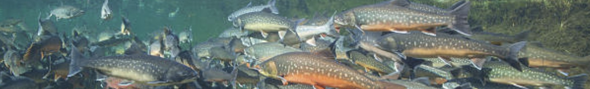
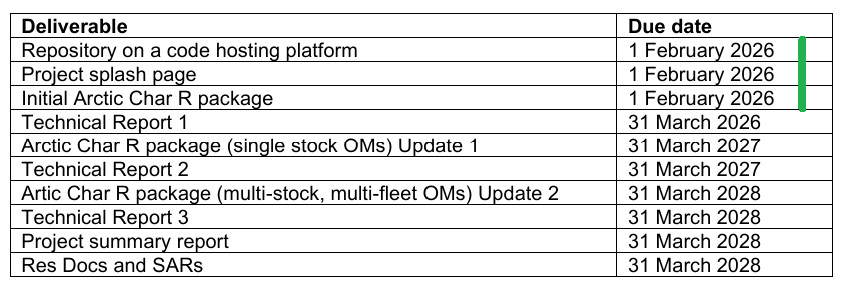
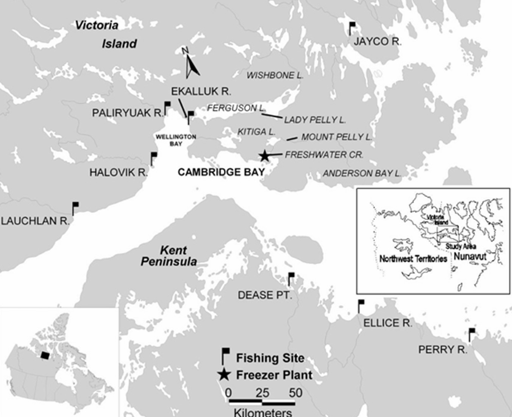

&nbsp;


<style>
  .col2 {
    columns: 2 200px;         /* number of columns and width in pixels*/
    -webkit-columns: 2 200px; /* chrome, safari */
    -moz-columns: 2 200px;    /* firefox */
  }
  .col3 {
    columns: 3 100px;
    -webkit-columns: 3 100px;
    -moz-columns: 3 100px;
  }
  .col4 {
    columns: 4 100px;
    -webkit-columns: 4 100px;
    -moz-columns: 4 100px;
  }
</style>

<style type="text/css">

body{ /* Normal  */
   font-size: 13px;
}
td {  /* Table  */
   font-size: 11px;
}
h1 { /* Header 1 */
 font-size: 18px;
 color: DarkBlue;
}
h2 { /* Header 2 */
 font-size: 15px;
 color: DarkBlue;
}
h3 { /* Header 3 */
 font-size: 14px;
 color: DarkBlue;
}
code.r{ /* Code block */
  font-size: 10px;
}
pre { /* Code block */
  font-size: 10px
}
</style>


***



***

&nbsp;


***

```{r setup, include=FALSE}
library(openMSE)
library(dplyr)
library(kableExtra)
library(readxl)
library(mahiMSE)

knitr::opts_chunk$set(echo = FALSE)

maketab <- function(dir,Alab="Statistical Area"){
  filenam = list.files(dir)
  nf = length(filenam)
  DF = data.frame(filenam)
  names(DF) = c("Area")
  #filepath = list.files(dir, full.names = T, include.dirs = T)
  fit.link = paste0('<a href=', file.path(dir, filenam), '> ', DF$Area , ' </a>')
  DF$Area <- fit.link
  DT::datatable(DF, escape=1,
                colnames=c(Alab),
                filter = 'top',
                options = list(
                  pageLength = 10, 
                  autoWidth = TRUE,
                  sDom  = '<"top">lrt<"bottom">ip'))
}


plotatab <- function(filey,sheet,head=T){
  if(head){
    dat = read_xlsx(paste0(getwd(),"/",filey),sheet)
    kable(dat,"simple") 
  }else{
    dat = read_xlsx(paste0(getwd(),"/",filey),sheet,col_names=F)
    kable(dat,"simple",col.names=rep("",ncol(dat))) 
  }
}


getprojectinfo<-function(page){
  tab=as.data.frame(read_excel("project_Info/Status Assumptions To do.xlsx", sheet = page))
  tab=tab[,2:3]
  tab[is.na(tab)]=""
  kable(tab,"simple")#,col.names=rep("",2)) 
}
  

getprog<-function(page){
  tab=as.data.frame(read_excel("Project_Info/Progress.xlsx", sheet = page))
  tab=tab[,2:3]
  tab[is.na(tab)]=""
  kable(tab,"simple")#,col.names=rep("",2)) 
}
 

```


## Disclaimer

The following work is preliminary and intended only as tool for eliciting feedback on data, modelling and other aspects of this fishery. 

None of these results are final. 

These analyses do not necessarily reflect the point of view of DFO and in no way anticipate DFO future policy.

***

## Objective

Develop an decision support tool for guiding data collection, scientific assessment and management advice for Cambridge Bay Arctic Char. 

***

## Project details

Title: 'Scientific Support Related to Cambridge Bay Arctic Char Research'

```{r ProjDets, eval=T}
dat<-data.frame(c("Term","Funding body","Solicitation No.","Contract No.","Project Partners","Blue Matter Team","DFO Collaborators"),
                
                 c("Jan 2026 - March 2028",
                   "Canadian Department of Fisheries and Oceans",
                   "30007324",
                   "45000101317",
                   "Blue Matter Science Ltd.",
                   "Tom Carruthers, Adrian Hordyk, Quang Huynh",
                   "Les Harris"))

kable(dat,"simple",col.names=rep("",2)) 

```

***

## Progress

The contract was executed in January 2026. Currently the initial three deliverables have been developed in a preliminary state: the repository, splash page (this document) and R package. 



Figure 1. Project deliverables. 

***

## Products

* [ArticticChar_DataMethods (private, data and code for operating models)](https://github.com/Blue-Matter/ArcticChar_DataMethods) - a private github repository containing data and methods for operating model development.

* [ArcticChar](https://github.com/Blue-Matter/ArcticChar) - a public github repository containing operating models, management procedures (harvest strategies) and performance metrics.


***

## Current Priorities

Table 1. MSE framework development priorities

```{r ToDo, eval=T,echo=F}
plotatab('tables/Various.xlsx','ToDo')

```

***

## Stocks

There are five ecnomically important stocks of Arctic Char that drain into Cambridge Bay: the Ekalluk, Paliryuak, Halovik, Lauchlan and Jayco (Figure 2, DFO 2013) 



Figure 2. The study area (DFO 2013). 


***

## Data Sources

### Biological Data

Various biological datasets are available for each river including somatic growth (Figures 3 and 4) and paired weight length observations (Figure 5) 


Figure 3. Length-at-age observations for male and female fish in the Ekalluk River. 


Figure 4. Statistical model fit to length-at-age observations for male and female fish (combined) in the Ekalluk River. 


Figure 5. Statistical model fit to length-weight observations for fish in the Ekalluk River. 


### Survey data


Figure 6. Sampling intensity for the Ekalluk river. 


### Fishery catches


Figure 7. Fishery landings for the Ekalluk river (1960 - 2024). 


### Length compositions 


Figure 8. Observed (black) and model-predicted (red) length composition frequencies for recent years of the time series for the Ekalluk River (see Fitted Operating Model report below for more details).  


***

## Fitted Operating Models

An example of a prelminary statistical catch-at-age model (RCM, Huynh 2024) fit for the Ekalluk river is available  [here](Reports/RCMfit_Ekalluk.html) which provides a summary of diagnostics available. 

The aim is to synthesize the available data for each river and conduct similar fits for assumptions that span a plausible range of uncertainties. 

These operating models can be used to design data collection and management procedures. 


***

## The ArcticChar R Package

### Functionality

The aim of the R package is to provide a single source for objects (data inputs, fitted operating models) and code (management options, custom figures) used in the provision of management advice. These are intended to be public-facing and pubically available in support of peer review. By building the package from a GitHub repository progress and features can be tracked and version control can be implemented. 

### Installation

The Arctic Char R package uses the openMSE libraries for fitting operating models and conducting simulation tests. To install openMSE:


```{r installation_openMSE, eval=F, echo=T}

install.packages('openMSE')

```

Using the remotes package, the latest version of the ArcticChar R package can be installed driectly from the GitHub repo: 

```{r installation, eval=F, echo=T}

library(remotes)
install_github('Blue-Matter/ArcticChar')

```

You can check package versions using: 

```{r check_version, eval=F, echo=T}

packageVersion('openMSE')
packageVersion('ArcticChar')

```

### Objects

In this preliminary version, ArcticChar only includes a small number of demonstration objects. One of those is the RCM fitting object for Ekalluk River and the resulting operating model. You can find those using the avail function:

```{r objects, eval=F, echo=T}
library(ArcticChar)
avail('RCModel') # the available RCM fitted models
avail('OM')      # the operating model resulting from those fits

class?OM         # help documentation about operating models
class?RCModel    # help documentation on RCM model fit objects
 
```


### Examining input data

```{r inputdata, eval=T, echo=T}
library(ArcticChar)
data = Fit_Ekalluk@data        # Take the input data from the fitted RCM model
class(data)                    # What class is is this
class?RCMdata                  # Find out more about how data is formatted for RCM

yearlabel = data@Misc$CurrentYr - (data@Misc$nyears-1):0 # make the right year label
plot(yearlabel, data@Chist, xlab="Year", ylab = "Catches (kg)") # plot the catches

```

### Plotting model fit

To generate an html report file for a fitted RCM object, you can use the generic plot method: 

```{r plotfit, eval=F, echo=T}
library(ArcticChar)
plot(Fit_Ekalluk)

```

The same works for the OM object:

```{r plotOM, eval=F, echo=T}
plot(OM_Ekalluk)
```

### Example closed-loop simulations

Operating models are used to test management options over projected years. 

First start by reconstructing the historical fishery and calculate all management reference points using Simulate:

```{r hist, eval=T, echo=T}
Hist = Simulate(OM_Ekalluk)
?Simulate              # help documentation
```

Note this returns a warning abotu index 1 which is a placeholder and only has one observation - openMSE cannot calculate statistical properties of indices if the only have 1 observation!

You can now select a management option and do a projection: 

```{r proj, eval=T, echo=T}

avail('MP')                  # all the available management options
myMPs = c("NFref", "FMSYref50", "FMSYref75", "FMSYref") # lets just project zero fishing and three fractions of perfectly implmented FMSY fishing
MSE = Project(Hist, myMPs)

```

The MSE object contains all the information about the projections such as catches, spawning biomass, recruitment etc. You can make your own plotting methods or just use the generic tools in openMSE such as the 'simple plot' Splot():

```{r splot, eval=T, echo=T}
Splot(MSE)
class?MSE  # find out more about objects of class MSE
```

There are also some DFO-specific performance plots:

```{r dfo_plot, eval=T, echo=T}
DFO_proj(MSE) # overfishing / underfishing at the end of the time series
?DFO_proj     # help documentation
```

### R package development

Over the project, data inputs are to be refined, operating models conditioned on data, custom management options tested and bespoke plots and performance metrics will be codified. 


***

## Links to Software and Code

[Rapid Conditioning Model (RCM) (Huynh 2024)](https://samtool.openmse.com/reference/RCM.html)

[OpenMSE (Hordyk et al. 2024)](https://openMSE.com)

[ArcticChar](https://github.com/Blue-Matter/ArcticChar)

[ArticticChar_DataMethods (private, data and code for operating models)](https://github.com/Blue-Matter/ArcticChar_DataMethods)

***


## Arctic Char Links


***


## Reports 

(DFO. 2013. Update assessment of the Cambridge Bay Arctic Char Fishery, 1960 to 2009. DFO Can. Sci. Advis. Sec. Sci. Advis. Rep. 2013/051.)[refs/DFO 2013 349861.pdf] 

***

## Recent Presentations


***


## References


Hordyk, A. 2025. Slick decision analysis. Available from: [https://harveststrategies.org/slick-user-guide.html](https://harveststrategies.org/slick-user-guide.html) 

Hordyk, A., Huynh, Q., Carruthers, T. 2025. OpenMSE: An open-source R package for Management strategy evaluation, available from: https://openmse.com

Huynh, Q., 2025. Rapid Conditioning model. Available from [https://openmse.com/tutorial-rcm/](https://openmse.com/tutorial-rcm/) 

Punt, A.E., Butterworth, D.S., de Moor, C.L., De Oliveira, J.A.A., and Haddon, M. 2016. Management strategy evaluation: Best practices. Fish Fish. 17(2): 303–334. doi:10.1111/faf.12104. 


***

## Acknowledgements

Many thanks to Les Harris for project coordination and helping to guide project development. 

Blue Matter: Tom Carruthers, Adrian Hordyk, Quang Huynh

OpenMSE was developed with support from the Natural Resources Defense Council (NRDC), the Gordon and Betty Moore Foundation, the Packard Foundation, the Marine Stewardship Council, Fisheries and Oceans Canada (DFO), the U.S. National Oceanic and Atmospheric Administration, the International Commission for the Conservation of Atlantic Tunas (ICCAT) and The Ocean Foundation.

OpenMSE continues to be developed with the support of the The Ocean Foundation. 


*** 


&nbsp;&nbsp;&nbsp;&nbsp;&nbsp;&nbsp;&nbsp;&nbsp;&nbsp;&nbsp;&nbsp;&nbsp;

