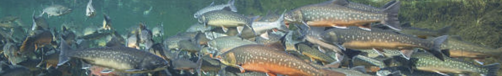
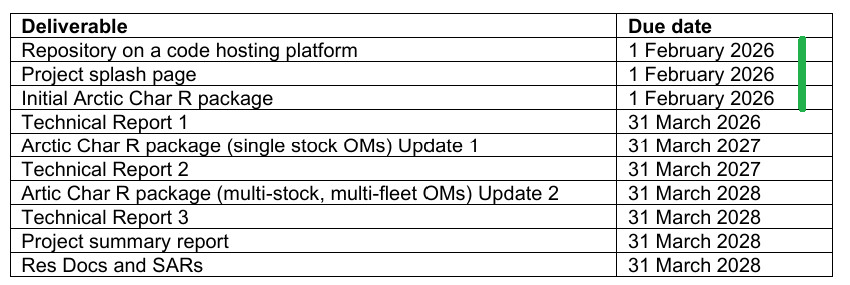
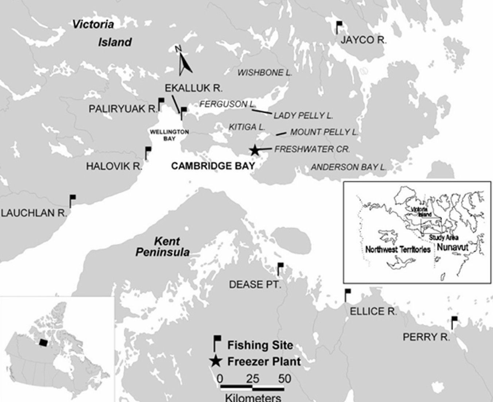
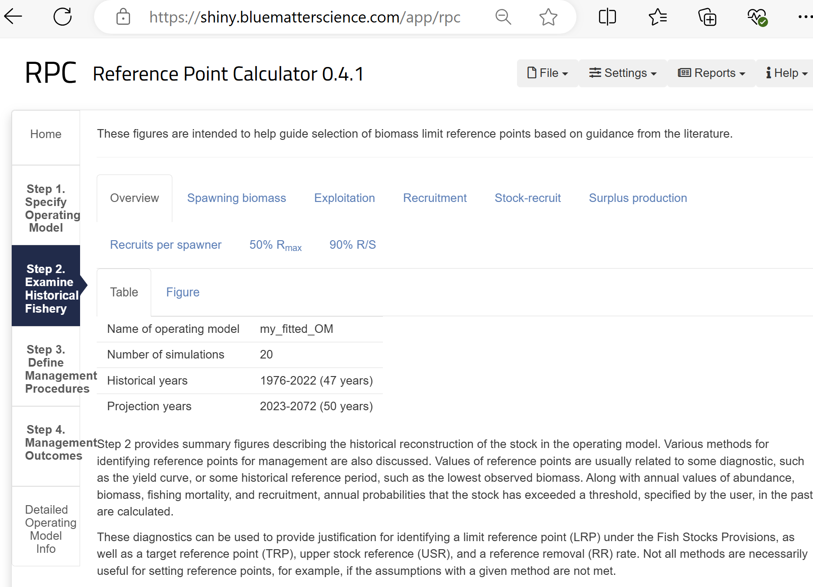
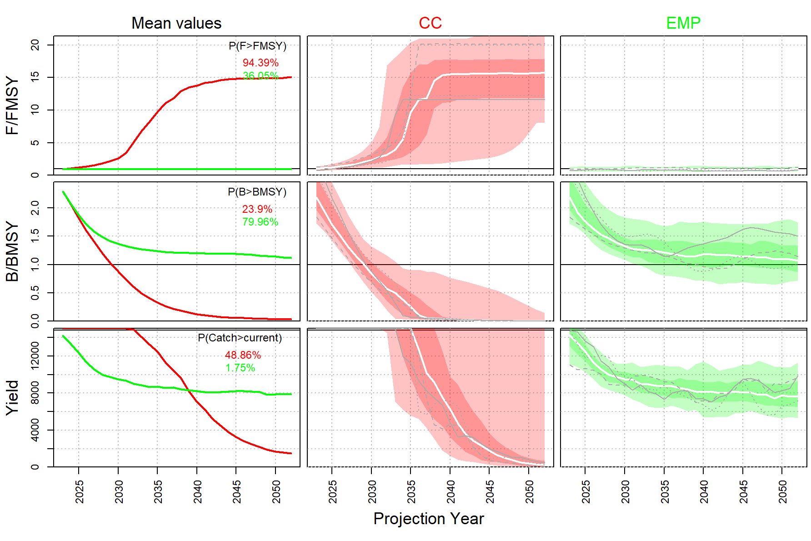

&nbsp;


<style>
  .col2 {
    columns: 2 200px;         /* number of columns and width in pixels*/
    -webkit-columns: 2 200px; /* chrome, safari */
    -moz-columns: 2 200px;    /* firefox */
  }
  .col3 {
    columns: 3 100px;
    -webkit-columns: 3 100px;
    -moz-columns: 3 100px;
  }
  .col4 {
    columns: 4 100px;
    -webkit-columns: 4 100px;
    -moz-columns: 4 100px;
  }
</style>

<style type="text/css">

body{ /* Normal  */
   font-size: 13px;
}
td {  /* Table  */
   font-size: 11px;
}
h1 { /* Header 1 */
 font-size: 18px;
 color: DarkBlue;
}
h2 { /* Header 2 */
 font-size: 15px;
 color: DarkBlue;
}
h3 { /* Header 3 */
 font-size: 14px;
 color: DarkBlue;
}
code.r{ /* Code block */
  font-size: 10px;
}
pre { /* Code block */
  font-size: 10px
}
</style>


***



***

&nbsp;


***

```{r setup, include=FALSE}
library(openMSE)
library(dplyr)
library(kableExtra)
library(readxl)
library(mahiMSE)
library(RPC) 

knitr::opts_chunk$set(echo = FALSE)

maketab <- function(dir,Alab="Statistical Area"){
  filenam = list.files(dir)
  nf = length(filenam)
  DF = data.frame(filenam)
  names(DF) = c("Area")
  #filepath = list.files(dir, full.names = T, include.dirs = T)
  fit.link = paste0('<a href=', file.path(dir, filenam), '> ', DF$Area , ' </a>')
  DF$Area <- fit.link
  DT::datatable(DF, escape=1,
                colnames=c(Alab),
                filter = 'top',
                options = list(
                  pageLength = 10, 
                  autoWidth = TRUE,
                  sDom  = '<"top">lrt<"bottom">ip'))
}


plotatab <- function(filey,sheet,head=T){
  if(head){
    dat = read_xlsx(paste0(getwd(),"/",filey),sheet)
    kable(dat,"simple") 
  }else{
    dat = read_xlsx(paste0(getwd(),"/",filey),sheet,col_names=F)
    kable(dat,"simple",col.names=rep("",ncol(dat))) 
  }
}


getprojectinfo<-function(page){
  tab=as.data.frame(read_excel("project_Info/Status Assumptions To do.xlsx", sheet = page))
  tab=tab[,2:3]
  tab[is.na(tab)]=""
  kable(tab,"simple")#,col.names=rep("",2)) 
}
  

getprog<-function(page){
  tab=as.data.frame(read_excel("Project_Info/Progress.xlsx", sheet = page))
  tab=tab[,2:3]
  tab[is.na(tab)]=""
  kable(tab,"simple")#,col.names=rep("",2)) 
}
 

```


## Disclaimer

The following work is preliminary and intended only as tool for eliciting feedback on data, modelling and other aspects of this fishery. 

None of these results are final. 

These analyses do not necessarily reflect the point of view of DFO and in no way anticipate DFO future policy.

***

## Objectives

Develop an decision support tool for guiding data collection, scientific assessment and management advice for Cambridge Bay Arctic Char. 

There are various components to this work: 

* Determine a suitable modeling framework for resolving ref points for Cambridge Bay Arctic Char, 

* Determine appropriate data collection protocols (scientific - to improve assessments, management - to support management decision making that can achieve objectives). 

* Extending/incorporating that model for exploratory fisheries and developing a data collection framework that will potentially inform assessments of the fisheries (e.g., how many years of data, frequency of data collection, what type of data are the priorities, etc.),

* Start exploring frameworks for incorporating environmental and mixed-stock fishery data.


***

## Project details

Title: 'Scientific Support Related to Cambridge Bay Arctic Char Research'

```{r ProjDets, eval=T}
dat<-data.frame(c("Term","Funding body","Solicitation No.","Contract No.","Project Partners","Blue Matter Team","DFO Collaborators"),
                
                 c("Jan 2026 - March 2028",
                   "Canadian Department of Fisheries and Oceans",
                   "30007324",
                   "45000101317",
                   "Blue Matter Science Ltd.",
                   "Tom Carruthers, Adrian Hordyk, Quang Huynh",
                   "Les Harris"))

kable(dat,"simple",col.names=rep("",2)) 

```

***

## Progress

The contract was executed in January 2026. Currently the initial three deliverables have been developed in a preliminary state: the repository, splash page (this document) and R package. 



Figure 1. Project deliverables. 

***

## Products

* [ArticticChar_DataMethods (private, data and code for operating models)](https://github.com/Blue-Matter/ArcticChar_DataMethods) - a private github repository containing data and methods for operating model development.

* [ArcticChar](https://github.com/Blue-Matter/ArcticChar) - a public github repository containing operating models, management procedures (harvest strategies) and performance metrics.


***

## Current Priorities

Table 1. MSE framework development priorities

```{r ToDo, eval=T,echo=F}
plotatab('tables/Various.xlsx','ToDo')

```

***

## Stocks

There are five ecnomically important stocks of Arctic Char that drain into Cambridge Bay: the Ekalluk, Paliryuak, Halovik, Lauchlan and Jayco (Figure 2, DFO 2013) 



Figure 2. The study area (DFO 2013). 


***

## Data Sources

### Biological Data

Various biological datasets are available for each river including somatic growth (Figures 3 and 4) and paired weight length observations (Figure 5) 


Figure 3. Length-at-age observations for male and female fish in the Ekalluk River. 


Figure 4. Statistical model fit to length-at-age observations for male and female fish (combined) in the Ekalluk River. 


Figure 5. Statistical model fit to length-weight observations for fish in the Ekalluk River. 


### Survey data


Figure 6. Sampling intensity for the Ekalluk river. 


### Fishery catches


Figure 7. Fishery landings for the Ekalluk river (1960 - 2024). 


### Length compositions 


Figure 8. Observed (black) and model-predicted (red) length composition frequencies for recent years of the time series for the Ekalluk River (see Fitted Operating Model report below for more details).  


***

## Fitted Operating Models

An example of a prelminary statistical catch-at-age model (RCM, Huynh 2024) fit for the Ekalluk river is available  [here](Reports/RCMfit_Ekalluk.html) which provides a summary of diagnostics available. 

The aim is to synthesize the available data for each river and conduct similar fits for assumptions that span a plausible range of uncertainties. 

These operating models can be used to design data collection and management procedures. 


***

## The ArcticChar R Package

### Functionality

The aim of the R package is to provide a single source for objects (data inputs, fitted operating models) and code (management options, custom figures) used in the provision of management advice. These are intended to be public-facing and pubically available in support of peer review. By building the package from a GitHub repository progress and features can be tracked and version control can be implemented. 

### Installation

The Arctic Char R package uses the openMSE libraries for fitting operating models and conducting simulation tests. To install openMSE:


```{r installation_openMSE, eval=F, echo=T}

install.packages('openMSE')

```

Using the remotes package, the latest version of the ArcticChar R package can be installed driectly from the GitHub repo: 

```{r installation, eval=F, echo=T}

library(remotes)
install_github('Blue-Matter/ArcticChar')

```

You can check package versions using: 

```{r check_version, eval=F, echo=T}

packageVersion('openMSE')
packageVersion('ArcticChar')

```

### Objects

In this preliminary version, ArcticChar only includes a small number of demonstration objects. One of those is the RCM fitting object for Ekalluk River and the resulting operating model. You can find those using the avail function:

```{r objects, eval=F, echo=T}
library(ArcticChar)
avail('RCModel') # the available RCM fitted models
avail('OM')      # the operating model resulting from those fits

class?OM         # help documentation about operating models
class?RCModel    # help documentation on RCM model fit objects
 
```

### Origins of RCMfit

The Fit_Ekalluk object is the output of the RCM fitting function. That output actually includes the two principle inputs to the fitting process:

* An OM object without any of the fitted estimates - recruitment, fishing mortality rates, selectivity).
* A formatted data object of class RCMdata

You can use these to redo the model fitting. Perhaps you want to change some of the fitting options such as likelihood functions or data weighting, or maybe just out of curiousity to see it in action. 

To do that, remove the OM and RCMdata objects from the RCMfit output and rerun RCM:

```{r RCMfit, eval = F, echo=T}

OM = Fit_Ekalluk@OM                          # The input OM object
RCMdata = Fit_Ekalluk@data                   # The RCM data object

setup()                                      # Set up parallel computation
fit = RCM(OM,                                # Blank operating model object missing Rec, F and sel estimates
          RCMdata,                           # Formatted RCMdata object
          s_selectivity='logistic_length',   # Survey selectivity is parameterized as logistic and length based
          mean_fit = T,                      # Include a single model fit at the mean value of the various input parameters
          drop_nonconv=T,                    # Drop any simulations (draws of parameters) that led to non-convergence
          drop_highF=T,                      # Drop any simulations (draws of parameters) that hit F max bounds
          cores=8)                           # Do the calculations in parallel over 8 threads


?RCM                                         # Find out more about the Rapid Conditioning Model
```

### Examining input data

```{r inputdata, eval=T, echo=T}
library(ArcticChar)
data = Fit_Ekalluk@data        # Take the input data from the fitted RCM model
class(data)                    # What class is is this
class?RCMdata                  # Find out more about how data is formatted for RCM

yearlabel = data@Misc$CurrentYr - (data@Misc$nyears-1):0 # make the right year label
plot(yearlabel, data@Chist, xlab="Year", ylab = "Catches (kg)") # plot the catches

```

### Plotting model fit

To generate an html report file for a fitted RCM object, you can use the generic plot method: 

```{r plotfit, eval=F, echo=T}
library(ArcticChar)
plot(Fit_Ekalluk)

```

The same works for the OM object:

```{r plotOM, eval=F, echo=T}
plot(OM_Ekalluk)
```

### Example closed-loop simulations

Operating models are used to test management options over projected years. 

First start by reconstructing the historical fishery and calculate all management reference points using Simulate:

```{r hist, eval=T, echo=T}
Hist = Simulate(OM_Ekalluk)
?Simulate              # help documentation
```

Note this returns a warning abotu index 1 which is a placeholder and only has one observation - openMSE cannot calculate statistical properties of indices if the only have 1 observation!

You can now select a management option and do a projection: 

```{r proj, eval=T, echo=T}

avail('MP')                  # all the available management options
myMPs = c("NFref", "FMSYref50", "FMSYref75", "FMSYref") # lets just project zero fishing and three fractions of perfectly implmented FMSY fishing
MSE = Project(Hist, myMPs)

```

The MSE object contains all the information about the projections such as catches, spawning biomass, recruitment etc. You can make your own plotting methods or just use the generic tools in openMSE such as the 'simple plot' Splot():

```{r splot, eval=T, echo=T}
Splot(MSE)
class?MSE  # find out more about objects of class MSE
```

There are also some DFO-specific performance plots:

```{r dfo_plot, eval=T, echo=T}
DFO_proj(MSE) # overfishing / underfishing at the end of the time series
?DFO_proj     # help documentation
```

### Evaluating Reference Points

The hist object contains various reference points that are calculated during the historical simulations.

You can take a look at some of the standard equilibrium reference points that are calculated by simulations

```{r refpts, eval=T, echo=T}

round(head(Hist@Ref$ReferencePoints),3)     # First 6 simulations
hist(Hist@Ref$ReferencePoints$BMSY_B0)      # Histogram of BMSY relative to unfished
names(Hist@Ref$Dynamic_Unfished)                   # Dynamic reference points 
names(Hist@Ref$ByYear)                             # Reference points that are annual

```

OpenMSE objects are compatible with and R package and App 'Reference Point Calculator' (RPC)

Reference Point Calculator (Huynh et al. 2022) is an R package and App designed for the exploration of reference points and the testing of management procedures / Harvest Control Rules (HCRs). The package was developed as part of a DFO grant and allows for the calculation of a very wide range of reference points. 

```{r RPC_install, eval=F}

install_github('Blue-Matter/RPC') # Install RPC app (only need to do this once!)
library(RPC)                      # Load RPC app for this session

```

Many of the RPC plotting functions use objects of class 'Hist' that are historical reconstructions of the type calculated above (using Simulate()). 

If you want a summary of the historical stock dynamics:

```{r RPC_hist, eval=T,out.width="50%", out.height="50%"}
hist_bio(Hist)
```

Also available are the yield curves (equilibrium catches at various population / exploitation levels):

```{r RPC_yieldcurves, eval=T,out.width="50%", out.height="50%"}
hist_YieldCurve(Hist)
```

Here we plot the SSB history relative to MSY:

```{r RPC_SSB, eval=T,out.width="50%", out.height="50%"}
LRP_SSBMSY(Hist)
```

Exploitation rate relative to FMSY:

```{r RPC_F, eval=T,out.width="50%", out.height="50%"}
LRP_FMSY(Hist)
```

Spawning Potential Ratio:

```{r RPC_SPR, eval=T,out.width="50%", out.height="50%"}
LRP_SPR(Hist)
```

The historical recruitment:

```{r RPC_Rec, eval=T,out.width="50%", out.height="50%"}
LRP_R(Hist)
```

Spawning stock biomass (SSB) relative to the (mean) SSB corresponding to 50% max recruitment: 

```{r RPC_50Rmax, eval=T,out.width="50%", out.height="50%",fig.height=3}
LRP_50Rmax(Hist)
```

Historical surplus production: 

```{r RPC_SP, eval=T,out.width="50%", out.height="50%", fig.height=3}
LRP_SP(Hist)
```


The operating model is fully compatible with the shiny app [Reference Point Calculator](https://shiny.bluematterscience.com/app/rpc) to provide a very comprehensive report on ALL fishery reference points ever described (including the various plots above) and also allows for the testing of management procedures. 

To use the app you should save the operating model object to your computer, open the app link above and then upload your saved operating model object:

```{r RPC-export, eval=F, echo=T}
saveRDS(Fit_Ekalluk@OM, file="C:/temp/my_fitted_OM.rds") # this is the file you upload to the RPC app
```



### Empirical Management Procedures

The OpenMSE framework was expressly designed to provide a fast and powerful environment for testing fishery management procedures (MPs). An MP is any reproducible rule for calculating management advice from data. This could be setting TACs as a multiplier of some recent index level (a so called 'empirical MP') or the use of a data-rich stock assessment and harvest control rule. MPs can also be tested with varying qualities of data allowing for the evaluation of data collection protocols (how often, how frequent, what variable). 

For a demonstration we will design a constant exploitation rate management procedure of the type used in the management of high profile economically important species such as Atlantic Bluefin tuna. 

Since we do not yet have an index of abundance (real data) from which to run the simulations (openMSE uses the historical data and generates projected data based on the statistical properties of RCM fit) we will use a generic index of abundance 'Ind' that is provided for every year of an openMSE forward projection. This index has statistical properties determined by slots in the operating model object. Its variance, phrased as a coefficient of variation is slot (Iobs). You can actually view the past and future error structure of this simulated index in the Hist object:

```{r MP1, eval=F, echo=T}
OM_Ekalluk@Iobs   # Two values (upper and lower bounds) on the biomass index CV
class?Obs         # These are properties of the Obs object (observation error model) that makes up part of the OM
Hist@SampPars$Obs$Ierr_y # The matrix (simulation by year) of index errors (phrased as mulitpliers)
plot(density(Hist@SampPars$Obs$Ierr_y)) # look at the distribution

```

You can view these simulated data in the Data slot of the historical reconstruction object Hist. From that you can work out roughly the current ratio of catch to index and set up an empirical rule that keeps this constant exploitation rate (Catch / Index) in future years. 


```{r MP2, eval = F, echo=T}
Data = Hist@Data
Catches = Data@Cat
Index = Data@Ind
last5years = dim(Catches)[2] - 4:0
Catchlast5 = mean(Catches[,last5years])       # about 15000 kg
CI_ratio = Catchlast5 / sum(Index[, last5years]) # ratio is about 13000 kg / Index

```

MPs work for a simulation x and the same kind of Data object we used above. We are going to take the mean of the last three index observations and set a TAC that is based on the ratio calculated above. We will compare this to an MP that is a constant catch of catches from the last 5 years. 

```{r MP3, eval = F, echo=T}

EMP = function(x, Data, reps=NA, ...){ # Empirical MP
  CI_ratio = 13000                    # recent historical ratio of catches: index
  nyears = dim(Data@Ind)[2]           # most recent three years of index data
  last_3 = nyears - 0:2               # the index for the last three years
  Rec = new('Rec')                    # make a new recommendation object class?Rec
  I_last_3 = mean(Data@Ind[x,last_3]) # mean of index over last three years
  Rec@TAC = I_last_3 * CI_ratio       # TAC recommendation is linearly related to population size
  Rec
}

CC = function(x, Data, reps = NA, ...){ # Constant catch
  Rec = new('Rec')
  Rec@TAC = 15000                     # Catch never changes, its 15000 kg for every projection year
  Rec
}

class(EMP) = class(CC) = "MP"     # Assign the functions the openMSE class 'MP'

```

You can now run a projection and compare results:

```{r MP4, eval = F, echo = T}

myProj = Project(Hist,c("CC","EMP"))
Splot(myProj)

```



In this example, recent catches were too high to be maintained and crashed the stock withing 15 years. The responsive index based MP responded to available biomass and keep the stock near BMSY levels. 

Clearly much more advanced empirical MPs are possible that use a wide range of fishery inputs but the principle is well illustrated in this example. 

### ArcticChar R package development

Over the project, data inputs are to be refined, operating models conditioned on data, custom management options tested and bespoke plots and performance metrics will be codified. 


***

## Links to Software and Code

[Rapid Conditioning Model (RCM) (Huynh 2024)](https://samtool.openmse.com/reference/RCM.html)

[OpenMSE (Hordyk et al. 2024)](https://openMSE.com)

[ArcticChar](https://github.com/Blue-Matter/ArcticChar)

[ArticticChar_DataMethods (private, data and code for operating models)](https://github.com/Blue-Matter/ArcticChar_DataMethods)

***


## Arctic Char Links


***


## Reports 

(DFO. 2013. Update assessment of the Cambridge Bay Arctic Char Fishery, 1960 to 2009. DFO Can. Sci. Advis. Sec. Sci. Advis. Rep. 2013/051.)[refs/DFO 2013 349861.pdf] 

***

## Recent Presentations


***


## References


Hordyk, A. 2025. Slick decision analysis. Available from: [https://harveststrategies.org/slick-user-guide.html](https://harveststrategies.org/slick-user-guide.html) 

Hordyk, A., Huynh, Q., Carruthers, T. 2025. OpenMSE: An open-source R package for Management strategy evaluation, available from: https://openmse.com

Huynh, Q., 2025. Rapid Conditioning model. Available from [https://openmse.com/tutorial-rcm/](https://openmse.com/tutorial-rcm/) 

Punt, A.E., Butterworth, D.S., de Moor, C.L., De Oliveira, J.A.A., and Haddon, M. 2016. Management strategy evaluation: Best practices. Fish Fish. 17(2): 303–334. doi:10.1111/faf.12104. 


***

## Acknowledgements

Many thanks to Les Harris for project coordination and helping to guide project development. 

Blue Matter: Tom Carruthers, Adrian Hordyk, Quang Huynh

OpenMSE was developed with support from the Natural Resources Defense Council (NRDC), the Gordon and Betty Moore Foundation, the Packard Foundation, the Marine Stewardship Council, Fisheries and Oceans Canada (DFO), the U.S. National Oceanic and Atmospheric Administration, the International Commission for the Conservation of Atlantic Tunas (ICCAT) and The Ocean Foundation.

OpenMSE continues to be developed with the support of the The Ocean Foundation. 


*** 


## Appendix

### RCM

#### Overview

Arctic Char operating models were fitted using the age-structured Rapid Conditioning Model (RCM) in the SAMtool package (Huynh et al. 2025) included in the openMSE framework. The RCM is a statistical catch-at-age (or catch-at-length) model similar to stock assessment frameworks such as the Woods Hole Assessment Model (WHAM; Stock and Miller 2021) in that it is implemented in R using the Template Model Builder (TMB) library for non linear estimation (Kristensen et al. 2016). RCM has two important advantages over dedicated data-rich assessment packages that make it suited to conditioning operating models for the invertebrate case studies of this project: (1) it can accept a wide range of data types of varying sparsity, for example, catches by numbers for urchins and a combination of absolute biomass survey, age data and CPUE data for geoduck; (2) it is designed to fit to Monte Carlo samples of model parameters, conducting an individual model fit to, for example, a sample of steepness, natural mortality rate and somatic growth. In this application, the RCM can capture a much larger range of uncertainty in reconstructed fishing mortality and recruitment than a typical data-rich assessment model. 

#### RCM Applications

The RCM has previously been applied as an operating model conditioning approach in various peer-reviewed applications such as evaluation of rebuilding strategies for B.C. Inside Yelloweye Rockfish (Haggarty et al. 2022), development of management procedures for B.C. Inside Quillback Rockfish (DFO 2023b), the Bay of Fundy Herring MSE (Carruthers et al., 2023a) and in support of the MERA approach to data-moderate fisheries management (Carruthers et al., 2023b). The RCM has also been used to demonstrate OM conditioning in preliminary MSE analyses for a range of pelagic species such as South Atlantic Swordfish (Taylor et al. 2022), North Atlantic Blue Shark (Carruthers 2024) and Pacific Neon Flying Squid (Dai 2025).

#### References

Carruthers, T.R. 2024. Technical MSE demonstration for Atlantic Blue Shark. Collect. Vol. Sci. Pap. ICCAT, 81(9), 1-19. https://www.iccat.int/Documents/CVSP/CV081_2024/n_9/CV08109141.pdf

Carruthers, T.R., Hordyk, A.R., Huynh, Q.C., Singh, R., and Barrett, T.J. 2023. A Framework for Conditioning Operating Models for the Southwest Nova Scotia/Bay of Fundy Spawning Component of 4VWX Herring. DFO Can. Sci. Advis. Sec. Res. Doc. 2023/022. v + 103 p. https://www.dfo-mpo.gc.ca/csas-sccs/Publications/ResDocs-DocRech/2023/2023_022-eng.html

Carruthers, T. R., Huynh, Q. C., Hordyk, A. R., Newman, D., Smith, A. D. M., Sainsbury, K. J., Stokes, K., Morison, A., Agnew, D., Parma, A., Sobrino, I., & Longo, C. 2023b. Method evaluation and risk assessment: A framework for evaluating management strategies for data-limited fisheries. Fish and Fisheries, 24, 279–296. https://doi.org/10.1111/faf.12726

Dai, L. 2025. Management Strategy Evaluation for a short-lived species with only annual data: a case study of the Autumn cohort of Neon Flying Squid in the North Pacific Ocean. NPFC-2025-SSC NFS02-IP06. Available here. 

DFO. 2023b. Proceedings of the Pacific regional peer review on the Application of the Management Procedure Framework for Inside Quillback Rockfish in British Columbia in 2021; December 6-7, 2022. DFO Can. Sci. Advis. Sec. Proceed. Ser. 2023/036 https://www.dfo-mpo.gc.ca/csas-sccs/Publications/Pro-Cr/2023/2023_036-eng.html

Haggarty, D.R., Huynh, Q.C., Forrest, R.E., Anderson, S.C., Bresch, M.J., Keppel, E.A. 2022. Evaluation of potential rebuilding strategies for Inside Yelloweye Rockfish (Sebastes ruberrimus) in British Columbia. DFO Can. Sci. Advis. Sec. Res. Doc. 2021/008. vi + 139 p. https://www.dfo-mpo.gc.ca/csas-sccs/Publications/ResDocs-DocRech/2021/2021_008-eng.html

Kristensen, K., et al. 2016. TMB:  Automatic Differentiation and Laplace Approximation. Journal of Statistical Software, 70(5), 1-21. https://doi.org/10.18637/jss.v070.i05  

Stock, B.C., Miller, T.J. 2021. The Woods Hole Assessment Model (WHAM): A general state-space assessment framework that incorporates time- and age-varying processes via random effects and links to environmental covariates. Fish. Res. 240. https://doi.org/10.1016/j.fishres.2021.105967.

Taylor, N.G., Mourato, B., Parker, D. 2022. Preliminary closed-loop simulation of management procedure performance for southern Swordfish. Collect. Vol. Sci. Pap. ICCAT, 79(2): 705-714. https://www.iccat.int/Documents/CVSP/CV081_2024/n_7/CV08107016.pdf

&nbsp;&nbsp;&nbsp;&nbsp;&nbsp;&nbsp;&nbsp;&nbsp;&nbsp;&nbsp;&nbsp;&nbsp;

